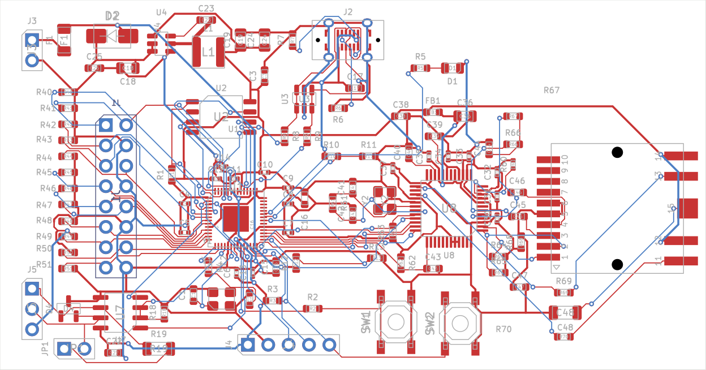

# RP2040 ICND1065L Panel Controller PCB

**Development snapshot, 2026-09-25. NOT FOR MANUFACTURE.**

A custom two-layer 88 x 46.1 mm controller for the tested 64 x 32 ICND1065L
LED panel. Bare RP2040, 8 MiB flash, vertical USB-C, non-isolated RS-485,
W5500 Ethernet and a vertical HanRun HR963380AE integrated-magnetics jack.
KiCad 10.0.6 project, 103 components. The custom PCB has not been fabricated
or tested; the working YD-RP2040 module firmware is a separate result.

## Текущо състояние

- Основният `pico-panel.kicad_pcb` е последната ръчна подредба на потребителя,
  без писти. Не е презаписвана от генератора след ръчните корекции.
- `routing-trial/pico-panel.kicad_pcb` е отделно пробно трасиране със същите
  позиции и ориентации. Два слоя, 111 преходни отвора.
- Проверка на подредбата: 0 DRC нарушения, 285 неопроводени връзки.
- Проверка на пробното трасиране след локалните корекции: 0 DRC нарушения,
  **1 неопроводена връзка QSPI_D1: U2.2 към U1.55**.
- ERC на схемата: 0 нарушения. Това не заменя проверката на схемното решение.
- USB/Ethernet диференциалните трасета, земята и обратните токови пътища,
  кварцовите вериги, импулсният регулатор и защитите още изискват преглед.
- Няма производствено одобрение, Gerber release или потвърдени измервания.

## Файлове

| Файл / папка | Предназначение |
| --- | --- |
| `pico-panel.kicad_pro` | Основен KiCad проект |
| `pico-panel.kicad_sch` | Пълна схема |
| `pico-panel.kicad_pcb` | Запазена ръчна подредба, без писти |
| `Panel.pretty/`, `Panel.kicad_sym` | Локални footprints и символи |
| `parts.json`, `BOM.csv` | Компоненти, LCSC кодове, връзки и текущи позиции |
| `preview/schematic.pdf` | Актуален PDF на схемата |
| `preview/user-placement.png` | Актуална ръчна подредба |
| `routing-trial/` | Двата опита за трасиране, логове, DSN/SES и текущ резултат |
| `reports/` | ERC/DRC, netlist, проверки на конектора и исторически отчети |
| `reference/` | Използвани datasheets, чертежи и публичен CAD на конектора |
| `tools/` | Скриптове за генериране, проверки и обработка на пробния маршрут |

## Механика и свързване

- Размер 88 x 46.1 mm; два медни слоя; зададена дебелина 0.8 mm.
- J1 е женски 2 x 8, 2.54 mm, от долната страна, за ръчно запояване.
- Поглед отгоре: J1.1 е x=13.202, y=15.600 mm от горния ляв ъгъл.
  Пин 2 е вдясно, пин 3 отдолу. Тези координати не са променяни.
- Отделни +5 V/GND проводници захранват контролера от панела.
  USB VBUS не захранва контролера; за програмиране също са нужни панелните 5 V.
- GP2..GP13 са директни 3.3 V сигнали към панела. Буферите и R20..R31 (33 ohm)
  са премахнати по заявка на потребителя; 47 kohm pull-down резисторите остават.
- J3: +5 V/GND; J5: RS-485 A/B/GND. Неполяризирани 2.54 mm конектори.
- Ethernet не е PoE. Схемата е за общата средна точка на конкретния MagJack.

## Отваряне и възпроизвеждане

Клонирайте целия repository и отворете `pico-panel.kicad_pro` с KiCad 10.
Локалните библиотеки използват `${KIPRJMOD}`. За пробния маршрут отворете
директно `routing-trial/pico-panel.kicad_pcb`; той не заменя основната подредба.

Скриптовете са от Windows работната среда. Част от тях съдържат абсолютни
пътища до KiCad, Java и локалния каталог за компоненти; адаптирайте ги преди
стартиране на друга машина. `pcbnew` изисква Python средата на KiCad.

**Не изпълнявайте `build_pcb.py` или `apply_wide_placement.py` върху ръчно
редактирана платка:** те заменят подредбата. Генераторната подредба е по-стара
от последните ръчни корекции. Авторитетен е запазеният `.kicad_pcb` файл.

`routing-trial/README_BG.md` описва границите на теста и локалните корекции.
Скриптовете за миграции/корекции са еднократни операции, не общ build pipeline.

## Документация и история

- [Проектни решения и исторически варианти](DESIGN_BG.md)
- [Проверка на RJ45 footprint](ETHERNET_FOOTPRINT_BG.md)
- [Първоначална механична Ethernet проба](ETHERNET_OPTION_BG.md)
- [Проверен firmware за готовия Pico модул](../../pico/README_BG.md)

По-старите изображения в `preview/` и част от отчетите са от предишни размери
и по-малък брой елементи. Тази страница и текущите основни KiCad файлове
определят актуалното състояние. Локалните crash snapshots, editor lock files,
временни тестови схеми и дублиращи резервни копия не са публикувани.

Изтегленият файл `ABM8-25MHz.pdf` се оказа HTML страница, а не datasheet,
и е изключен от публикацията. Документацията и товарният капацитет на 25 MHz
кварца трябва да бъдат проверени допълнително преди производство.
Datasheets/CAD в `reference/` принадлежат на съответните производители.
